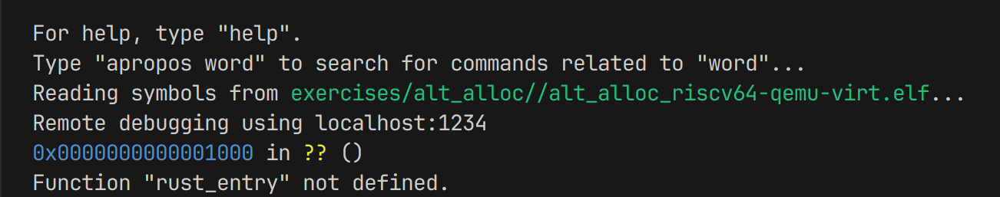
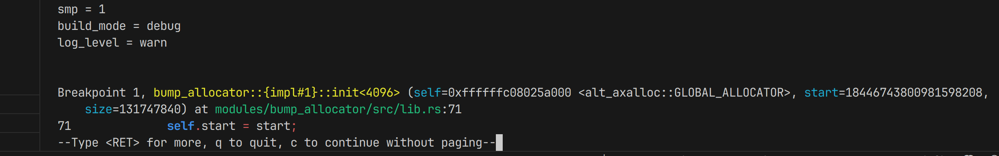
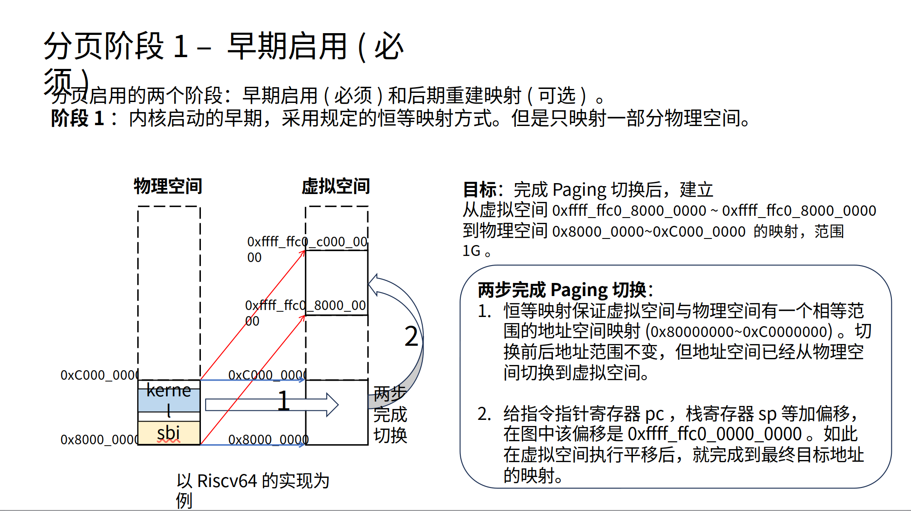

# 如何调试

首先，arceos/Makefile，把MODE改成debug: `MODE ?= debug`

以练习3为例，目标：停在arceos/modules/bump_allocator/src/lib.rs EarlyAllocator.init(&mut self, start: usize, size: usize)，看start和size的值是多少。

arceos/Makefile里已经写好了debug规则（用的gdb是gdb-multiarch，所以要先`sudo apt install gdb-multiarch`）：

```Makefile
debug: build
	$(call run_qemu_debug) &
	sleep 1
	$(GDB) $(OUT_ELF) \
	  -ex 'target remote localhost:1234' \
	  -ex 'b rust_entry' \
	  -ex 'continue' \
	  -ex 'disp /16i $$pc'
```
但是我直接`make debug A=exercises/alt_alloc/`gdb会提示找不到rust_entry的位置，不知道为什么：



所以，直接用 文件 + 行号 来断点，Makefile里debug规则加上一行：
```Makefile
debug: build
	$(call run_qemu_debug) &
	sleep 1
	$(GDB) $(OUT_ELF) \
	  -ex 'target remote localhost:1234' \
	  -ex 'b rust_entry' \
      -ex 'b modules/bump_allocator/src/lib.rs:48' \
	  -ex 'continue' \
	  -ex 'disp /16i $$pc'
```
然后`make debug A=exercises/alt_alloc/`能断住了，



然后`c`继续执行，断在init()函数的位置。然后`list`查看附近行，`next`执行到下一行，`frame`显示当前行，`p/x start`、`p/x size`以16进制打印start和size的值，结果为 0xffffffc08025b000 和 0x7da5000 。

我是在arceos/目录下执行的make debug，但是上面我写成`-ex 'b arceos/modules/bump_allocator/src/lib.rs:48'`也能断住，gdb好像有模糊匹配的功能。

# free memory的区域

`LOG=info make run A=exercises/alt_alloc/`，打印的日志中有

[PA:0x8025b000, PA:0x88000000) free memory (READ | WRITE | FREE)

一行，对应的打印代码在arceos/modules/axruntime/src/lib.rs rust_main。

但是上面debug，init()时交给EarlyAllocator管理的内存区域的开始地址start打印出来是 0xffffffc08025b000，这个0xffffffc0怎么来的？

似乎[course/stage3-2.pptx](https://github.com/LearningOS/2025s-arceos-plerks/blob/main/course/stage3-2.pptx)的第8页能解释：


