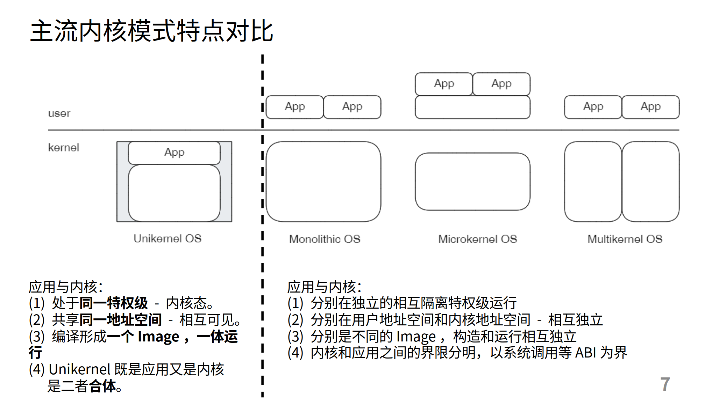

# 第四个练习

course/stage3-3.pptx第34页：

`[ramfs_rename]:支持ramfs的rename操作`

采用patch方式让工程临时使用oscamp/arceos/axfs_ramfs的本地组件仓库

修改本地组件axfs_ramfs，增加相关函数，实现部分trait，让测试通过

执行`make run A=exercises/ramfs_rename/ BLK=y`测试

# 实现
arceos/exercises/ramfs_rename/src/main.rs中调用了fs::rename

fs::rename调用了arceos_api::fs::ax_rename

arceos_api::fs::ax_rename在arceos/api/arceos_api/src/lib.rs中，其用了一个define_api!宏函数，让ax_rename定义为crate::imp::ax_rename

于是调用到的会是arceos/api/arceos_api/src/imp/fs.rs里的ax_rename，继续看，又调用的是axfs::api::rename(old, new)

axfs::api::rename(old, new)调用crate::root::rename(old, new)，即arceos/modules/axfs/src/root.rs的pub(crate) fn rename，其函数体返回值为`parent_node_of(None, old).rename(old, new)`

`parent_node_of`的返回值为`Arc<dyn VfsNodeOps + 'static>`，然后调用其rename函数，由于声明类型为VfsNodeOps，点一下IDE会跳到VfsNodeOps的rename函数：
```Rust
fn rename(&self, _src_path: &str, _dst_path: &str) -> VfsResult {
    ax_err!(Unsupported)
}
```
VfsNodeOps属于crate.io上的依赖[axfs_vfs](https://docs.rs/axfs_vfs/latest/axfs_vfs/)，这是个定义接口的，里面定义的全是trait。这和第二阶段rcore-camp-guide的`pub static ref BLOCK_DEVICE: Arc<dyn BlockDevice> = Arc::new(BlockDeviceImpl::new());`很像，用接口作为了声明类型，然后运行时调用函数发生动态绑定。

由于VfsNodeOps trait中提供了rename的默认实现(报err)，所以如果实际类型没有实现rename的话会调到这个默认实现，于是会报err。

于是找实现了VfsNodeOps的类型，arceos/axfs_ramfs/src/dir.rs中: `impl VfsNodeOps for DirNode`，但是impl中没有写rename函数，而由于VfsNodeOps trait中提供了rename的默认实现(报err)，所以会调到这个报err的rename默认实现。

于是，练习4只需要把`impl VfsNodeOps for DirNode`添上一个具体的rename函数实现即可，只需要改DirNode的self.BTreeMap即可。

# unikernel概念
训练营视频里讲unikernel时说的app和内核都在内核态，内核可以直接通过函数调用运行app，course/stage3-1.pptx第7页：



这个东西是这样的，arceos/modules/axruntime/src/lib.rs rust_main函数，rust_main函数体中有调用`unsafe { main() };`，main()是外部crate的函数：
```Rust
extern "C" {
    fn main();
}
```
对于练习4`make run A=exercises/ramfs_rename/ BLK=y`来讲，main就是arceos/exercises/ramfs_rename/src/main.rs中的main函数。

也就是说，编译链接的时候，用户程序的main和内核代码在一起平级的，只有一个内核态，用户main直接被rust_main调用。

这个unikernel概念应该只是教学前期构建简单操作系统使用，后面会分内核态与用户态。（补充：嵌入式的环境里也可以用这种unikernel概念的内核）

# 练习4的文件系统
练习4用到的文件系统 arceos/axfs_ramfs 是个内存文件系统，其Cargo.toml里有documentation[地址](https://docs.rs/axfs_ramfs/latest/axfs_ramfs/)。文档中说了自己是个"RAM filesystem used by ArceOS"。

arceos/exercises/ramfs_rename/Cargo.toml 开了"axstd/myfs" feature，这个feature会一通传导，打开axfs的"myfs" feature，然后

arceos/modules/axruntime/src/lib.rs rust_main()

$\downarrow$

axfs::init_filesystems()

$\downarrow$

self::root::init_rootfs()

init_rootfs()根据feature配置，会去调fs::myfs::new_myfs

```Rust
// arceos/modules/axfs/src/root.rs

pub(crate) fn init_rootfs(disk: crate::dev::Disk) {
    cfg_if::cfg_if! {
        if #[cfg(feature = "myfs")] { // override the default filesystem
            let main_fs = fs::myfs::new_myfs(disk);
```

$\downarrow$

然后`fs::myfs::new_myfs`调的是`crate_interface::call_interface!(MyFileSystemIf::new_myfs(disk))`，然后这个 MyFileSystemIf trait 是在 arceos/exercises/ramfs_rename/src/ramfs.rs 中实现的:

```Rust
// arceos/exercises/ramfs_rename/src/ramfs.rs

#[crate_interface::impl_interface]
impl MyFileSystemIf for MyFileSystemIfImpl {
    fn new_myfs(_disk: AxDisk) -> Arc<dyn VfsOps> {
        Arc::new(RamFileSystem::new())
    }
}
```
是调用 RamFileSystem::new() 生成的文件系统，_disk没有被使用。

RamFileSystem的结构为：
```Rust
pub struct RamFileSystem {
    parent: Once<VfsNodeRef>,
    root: Arc<DirNode>,
}
```
是个内存文件系统。